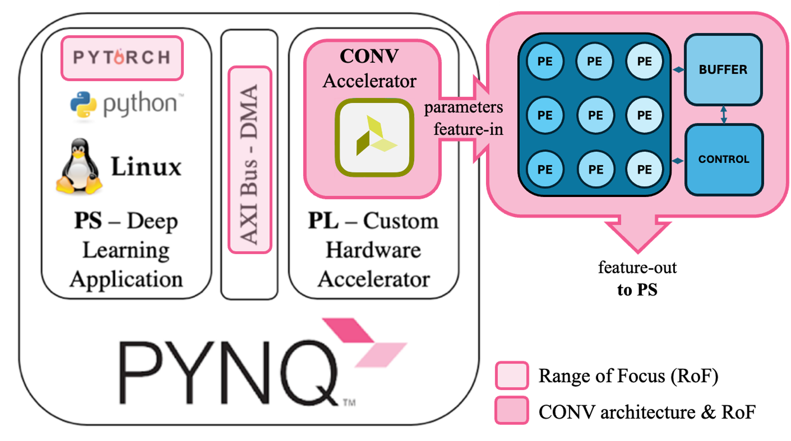

# A Convolution Accelerator for PyTorch Deep Learning Framework

Attention: This Project is at a very preliminary stage.

## Introduction
This project aims to design and implement a configurable convolutional accelerator on a Xilinx’s PYNQ Z1 FPGA,
optimized for integration with the PyTorch deep learning framework. The goal is to leverage FPGA’s reconfigurable
architecture to achieve high-performance, energy-efficient execution of convolutional neural networks (CNNs). The
project will focus on designing an accelerator that efficiently handles convolution operations through systolic
strategies, facilitating data reuse and reducing memory access. By integrating PyTorch, which allows easy and fast
model building, the accelerator will support flexible model configurations directly within the FPGA, enabling rapid
prototyping and deployment of deep learning models.
This implementation will build upon existing frameworks, such as the using AXI bus with DMAs to interface the
PyTorch with the programmable logic. The result is expected to be a configurable, fast convolutional accelerator that
making it suitable for edge computing and other real-time applications.
Fig.1 shows the Project Outline 

## References
[1] H. Wang and B. Raj, “On the Origin of Deep Learning,” arXiv (Cornell University), Jan. 2017, doi:
10.48550/arXiv.1702.07800.

[2] J. Hu, Y. Guo, L. Li and T. T. Toe, "Attention-based CNN for CT-Kidney Classification," 2023 6th International
Conference on Software Engineering and Computer Science (CSECS), Chengdu, China, 2023, pp. 1-8, doi:
10.1109/CSECS60003.2023.10428582.

[3] M. Capra, B. Bussolino, A. Marchisio, G. Masera, M. Martina and M. Shafique, "Hardware and Software
Optimizations for Accelerating Deep Neural Networks: Survey of Current Trends, Challenges, and the Road Ahead,"
in IEEE Access, vol. 8, pp. 225134-225180, 2020, doi: 10.1109/ACCESS.2020.3039858.

[4] H. Kim and K. Choi, "Low Power FPGA-SoC Design Techniques for CNN-based Object Detection Accelerator,"
2019 IEEE 10th Annual Ubiquitous Computing, Electronics & Mobile Communication Conference (UEMCON), New
York, NY, USA, 2019, pp. 1130-1134, doi: 10.1109/UEMCON47517.2019.8992929.

[5] T. Wu, W. Liu and Y. Jin, "An End-to-End Solution to Autonomous Driving Based on Xilinx FPGA," 2019
International Conference on Field-Programmable Technology (ICFPT), Tianjin, China, 2019, pp. 427-430, doi:
10.1109/ICFPT47387.2019.00084.

[6] B. Foster, S. Taneja, J. Manzano and K. Barker, "Evaluating Energy Efficiency of GPUs using Machine Learning
Benchmarks," 2023 IEEE International Parallel and Distributed Processing Symposium Workshops (IPDPSW), St.
Petersburg, FL, USA, 2023, pp. 42-50, doi: 10.1109/IPDPSW59300.2023.00019.

[7] A. Samajdar, Y. Zhu, P. Whatmough, M. Mattina, and T. Krishna, "SCALE-Sim: Systolic CNN Accelerator
Simulator," arXiv (Cornell University), Oct. 2018, doi: 10.48550/arXiv.1811.02883

[8] Y. Chen, J. Emer, V. Sze, “Eyeriss: A Spatial Architecture for Energy-Efficient Dataflow for Convolution Neural
Networks” [PowerPoint slides], Available: https://eems.mit.edu/wp-
content/uploads/2016/06/eyeriss_isca_2016_slides.pdf

[9] Y. Chen, T. Krishna, J. S. Emer and V. Sze, "Eyeriss: An Energy-Efficient Reconfigurable Accelerator for Deep
Convolutional Neural Networks," in IEEE Journal of Solid-State Circuits, vol. 52, no. 1, pp. 127-138, Jan. 2017, doi:
10.1109/JSSC.2016.2616357.

[10] Y. -H. Chen, T. -J. Yang, J. Emer and V. Sze, "Eyeriss v2: A Flexible Accelerator for Emerging Deep Neural
Networks on Mobile Devices," in IEEE Journal on Emerging and Selected Topics in Circuits and Systems, vol. 9, no.
2, pp. 292-308, June 2019, doi: 10.1109/JETCAS.2019.2910232.

[11] M. Vohra and S. Fasciani, "PYNQ-Torch: a framework to develop PyTorch accelerators on the PYNQ platform,"
2019 IEEE International Symposium on Signal Processing and Information Technology (ISSPIT), Ajman, United Arab
Emirates, 2019, pp. 1-6, doi: 10.1109/ISSPIT47144.2019.9001806.

[12] 牧士宁. (2022). 基于 ZYNQ 平台的自动语音识别算法设计与实现 (硕士学位论文, 电子科技大学).
硕士 https://link.cnki.net/doi/10.27005/d.cnki.gdzku.2022.000275doi:10.27005/d.cnki.gdzku.2022.000275.
