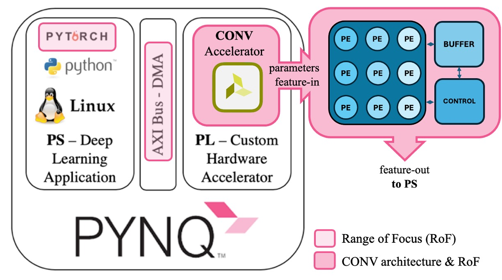

# A Convolution Accelerator for PyTorch Deep Learning Framework
## Introduction
This project aims to design and implement a configurable convolutional accelerator on a Xilinx’s PYNQ Z1 FPGA,
optimized for integration with the PyTorch deep learning framework. The goal is to leverage FPGA’s reconfigurable
architecture to achieve high-performance, energy-efficient execution of convolutional neural networks (CNNs). The
project will focus on designing an accelerator that efficiently handles convolution operations through systolic
strategies, facilitating data reuse and reducing memory access. By integrating PyTorch, which allows easy and fast
model building, the accelerator will support flexible model configurations directly within the FPGA, enabling rapid
prototyping and deployment of deep learning models.
This implementation will build upon existing frameworks, such as the using AXI bus with DMAs to interface the
PyTorch with the programmable logic. The result is expected to be a configurable, fast convolutional accelerator that
making it suitable for edge computing and other real-time applications.
Fig.1 shows the Project Outline 

